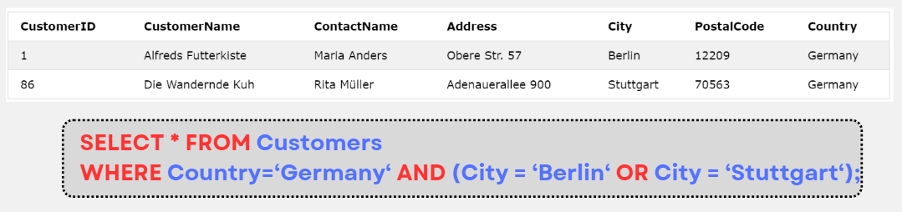

# MySQL AND, OR, NOT

:::info

- Toán tử **AND**, **OR** để lọc một record dựa trên nhiều điều kiện:
  - Toán tử **AND** sẽ hiển thị record nếu tất cả các điều kiện được phân tách bởi **AND** là True
  - Toán tử **AND** sẽ hiển thị record nếu ít nhất một điều kiện được phân tách bởi **OR** là True
- Toán tử **NOT** sẽ hiển thị record nếu các điều kiện là False

```sql
SELECT column1, column2, ...
FROM table_name
WHERE condition1 AND condition2 AND condition3 ...;
```

```sql
SELECT column1, column2, ...
FROM table_name
WHERE condition1 OR condition2 OR condition3 ...;
```

```sql
SELECT column1, column2, ...
FROM table_name
WHERE NOT condition;
```

:::

## Ví dụ

- Ví dụ sau sẽ select tất cả các Customers có Country là "Germany" và có City là "Berlin" hoặc "Stuttgart"


