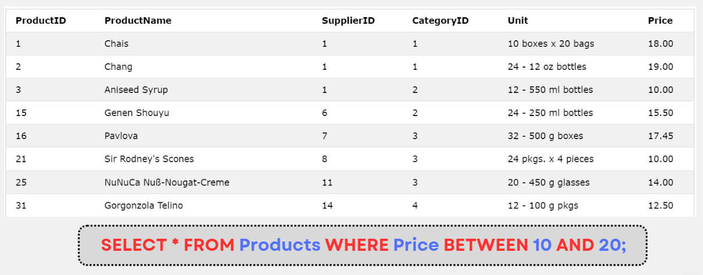
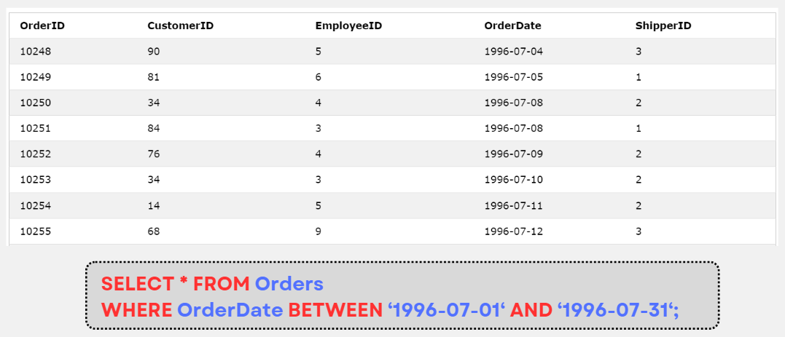

# MySQL BETWEEN

:::info

- Toán tử **BETWEEN** chọn các giá trị nằm trong một đoạn [a, b] được chỉ định. Các giá trị này có thể là số, chuỗi hoặc date.
- Cú pháp

```sql
SELECT column_name(s)
FROM table_name
WHERE column_name BETWEEN value1 AND value2;
```

- Để select các giá trị ngoài đoạn được chỉ định, ta kết hợp với toán tử **NOT**:

```sql
SELECT column_name(s)
FROM table_name
WHERE column_name NOT BETWEEN value1 AND value2;
```

:::

## Ví dụ




