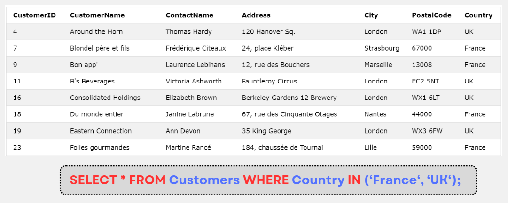

# MySQL IN

:::info

- Toán tử **IN** cho phép ta chỉ định nhiều giá trị trong mệnh đề **WHERE**
- Cú pháp:

```sql
SELECT column_name(s)
FROM table_name
WHERE column_name IN (value1, value2, ...);
```

```sql
SELECT column_name(s)
FROM table_name
WHERE column_name IN (SELECT STATEMENT);
```

:::

## Ví dụ



- Ví dụ sau sẽ select tất cả các customers mà có cùng country với suppliers:

```sql
SELECT * FROM Customers
WHERE Country IN (SELECT Country FROM Suppliers);
```
