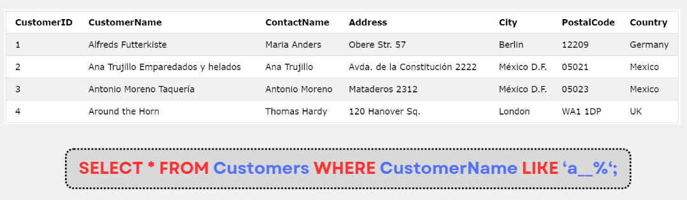

# MySQL LIKE

:::info

- Toán tử **LIKE** được sử dụng trong mệnh đề **WHERE** dùng để tìm kiếm theo chuỗi được chỉ định.
- Cú pháp:

```sql
SELECT column1, column2, ...
FROM table_name
WHERE columnN LIKE pattern;
```

- Có 2 kí tự đại diện được sử dụng trong toán tử **LIKE**:
  - Dấu phần trăm (%) đại diện cho 0, 1 hay nhiều kí tự
  - Dấu gạch dưới (\_) đại diện có 1 kí tự đơn
- 2 kí tự trên có thể được phối hợp với nhau

:::

| Pattern  | Description                                    |
| -------- | ---------------------------------------------- |
| 'a%'     | Giá trị bắt đầu bằng "a"                       |
| '%a'     | Giá trị kết thúc bằng "a"                      |
| '%or%'   | Giá trị có chứa "or"                           |
| '\_r%'   | Giá trị chứa "r" ở vị trí thứ 2                |
| 'a\_%'   | Giá trị bắt đầu bằng "a" và có ít nhất 2 kí tự |
| 'a\_\_%' | Giá trị bắt đầu bằng "a" và có ít nhất 3 kí tự |
| 'a%o'    | Giá trị bắt đầu bằng "a" và kết thúc bằng "o"  |

## Ví dụ


