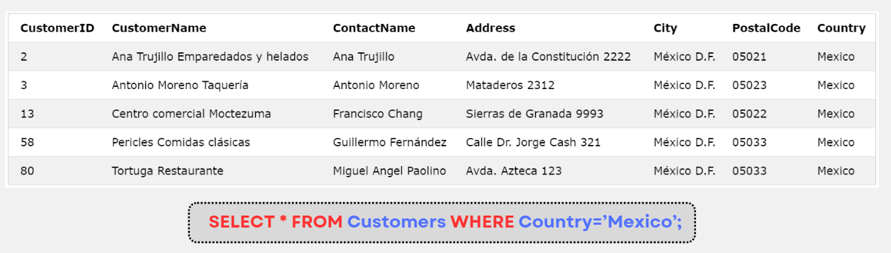

# MySQL WHERE

:::info

- Mệnh đề **WHERE** được sử dụng để lọc các record. Nó sẽ chỉ trích xuất những bản ghi đáp ứng một điều kiện cụ thể.
- Cú pháp:

```sql
SELECT column1, column2, ...
FROM table_name
WHERE condition;
```

- Mệnh đề **WHERE** không chỉ được sử dụng trong câu lệnh **SELECT** mà nó còn được sử dụng trong câu lệnh **UPDATE** và **DELETE**

:::

## Ví dụ



## Các toán tử được sử dụng trong câu lệnh WHERE

| Operator    | Description                                                                |
| ----------- | -------------------------------------------------------------------------- |
| =           | Bằng                                                                       |
| \>          | Lớn hơn                                                                    |
| \<          | Nhỏ hơn                                                                    |
| \>=         | Lớn hơn hoặc bằng                                                          |
| \<=         | Nhỏ hơn hoặc bằng                                                          |
| !=          | Khác                                                                       |
| BETWEEN     | Nằm giữa một khoảng được chỉ định.[Xem chi tiết](./sql-between)            |
| LIKE        | Tìm kiếm theo pattern.[Xem chi tiết](./sql-like)                           |
| IN          | Chỉ định nhiều giá trị có thể có trong một column.[Xem chi tiết](./sql-in) |
| AND         | [Xem chi tiết](./sql-and-or-not)                                           |
| OR          | [Xem chi tiết](./sql-and-or-not)                                           |
| NOT         | [Xem chi tiết](./sql-and-or-not)                                           |
| ANY         | [Xem chi tiết](../sql-select/sql-any-all#any)                              |
| ALL         | [Xem chi tiết](../sql-select/sql-any-all#all)                              |
| EXISTS      | [Xem chi tiết](../sql-select/sql-exists)                                   |
| IS NULL     | Kiểm tra giá trị của một cột có là giá trị NULL hay không                  |
| IS NOT NULL | Kiểm tra giá trị của một cột không phải là giá trị NULL hay không          |

- Ví dụ về `IS NULL`, `IS NOT NULL`:

```sql
SELECT CustomerName, ContactName, Address
FROM Customers
WHERE Address IS NULL;
```

```sql
SELECT CustomerName, ContactName, Address
FROM Customers
WHERE Address IS NOT NULL;
```
