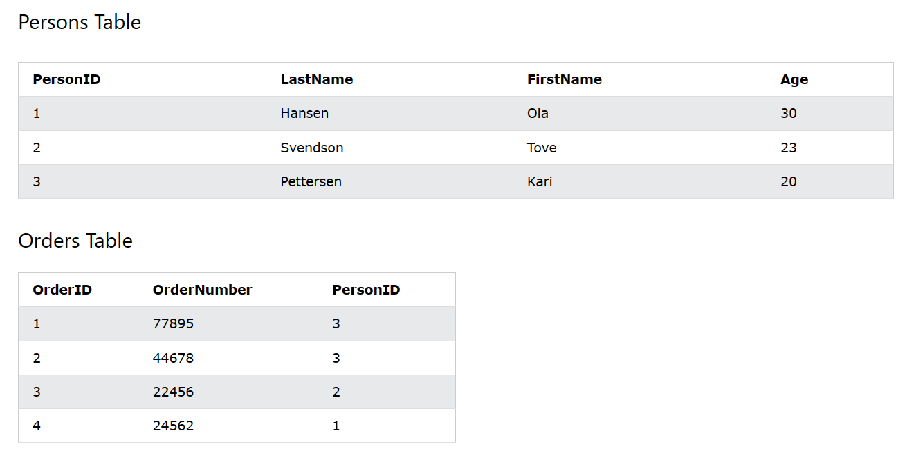

# MySQL Constraints

:::note

- Các ràng buộc SQL được sử dụng để chỉ định các quy tắc cho dữ liệu trong bảng.
- Các ràng buộc được sử dụng để giới hạn loại dữ liệu có thể đưa vào bảng. Điều này đảm bảo tính chính xác và độ tin cậy của dữ liệu trong bảng. Nếu có bất kỳ vi phạm nào giữa ràng buộc và hành động dữ liệu, hành động đó sẽ bị hủy bỏ.
- Các ràng buộc có thể là cấp độ cột hoặc cấp độ bảng. Các ràng buộc cấp độ cột áp dụng cho một cột và các ràng buộc cấp độ bảng áp dụng cho toàn bộ bảng.

:::

## NOT NULL

- Đảm bảo dữ liệu của cột không có giá trị NULL khi tạo bảng hoặc sửa đổi kiểu dữ liệu cho cột, ví dụ:

```sql
CREATE TABLE Persons (
    person_id INT NOT NULL,
    last_name VARCHAR(255) NOT NULL,
    first_name VARCHAR(255) NOT NULL,
    age INT
);
```

```sql
ALTER TABLE employee
MODIFY email VARCHAR(20) NOT NULL;
```

## UNIQUE

- Đảm bảo các tất cả các giá trị trong một cột đều khác nhau

### Tạo UNIQUE Constraints

- Tạo UNIQUE Constraints có tên:
  - UC_Person đối với cột **id** và **email** khi tạo bảng
  - UC_Person2 đối với cột **first_name** khi tạo bảng

```sql
CREATE TABLE Persons (
    id INT,
    last_name VARCHAR(20),
    first_name VARCHAR(20),
    email VARCHAR(20),
    age INT,
    CONSTRAINT UC_Persons UNIQUE (id, email),
    CONSTRAINT UC_Person2 UNIQUE (first_name)
);
```

- Tương tự như khi ALTER TABLE:

```sql
ALTER TABLE Persons
ADD CONSTRAINT UC_Person UNIQUE (id, email),
ADD CONSTRAINT UC_Person2 UNIQUE (first_name);
```

### Xóa UNIQUE Constraints

- Ở bên trên, ta đã tạo ra UNIQUE Constraints, bây giờ muốn xóa hãy dựa vào tên của constraints đó.

```sql
ALTER TABLE Persons
DROP INDEX UC_Person,
DROP INDEX UC_Person2;
```

## PRIMARY KEY

- Là khóa chính phân biệt mỗi record trong một bảng

### Thêm PRIMARY KEY

- Khi CREATE TABLE:

```sql
CREATE TABLE Persons (
    id INT,
    last_name VARCHAR(255),
    first_name VARCHAR(255),
    age INT,
    PRIMARY KEY (id)
);
```

- Khi ALTER TABLE:

```sql
ALTER TABLE Persons
ADD PRIMARY KEY (id);
```

### Xóa PRIMARY KEY

```sql
ALTER TABLE Persons
DROP PRIMARY KEY;
```

## FOREIGN KEY

- FOREIGN_KEY Constraints được dùng để ngăn chặn hành vi xóa liên kết giữa các bảng
- Một FOREIGN_KEY là một cột trong bảng, tham chiếu đến một PRIMARY_KEY trong một bảng khác
- Bảng có chứa FOREIGN_KEY được gọi là "bảng con", và bảng chứa khóa chính (PRIMARY_KEY) được gọi là bảng cha
- Ví dụ:



:::info

- Bảng "Orders" có liên kết với bảng "Persons" thông qua column "PersonID"
- Cột **PersonID** ở bảng "Persons" là PRIMARY KEY của bảng "Persons"
- Cột **PersonID** ở bảng **Orders** là FOREIGN KEY của bảng "Orders"
- Ràng buộc FOREIGN KEY ngăn không cho dữ liệu không hợp lệ được chèn vào cột khóa ngoại, vì nó phải là một trong các giá trị có trong bảng cha.

:::

### Tạo FOREIGN KEY

- Khi CREATE TABLE:

```sql
CREATE TABLE Orders (
    order_id INT,
    order_number INT,
    person_id INT,
    PRIMARY KEY (order_id),
    CONSTRAINT FK_PersonOrder FOREIGN KEY (person_id)
    REFERENCES Persons(person_id)
);
```

- Khi ALTER TABLE:

```sql
ALTER TABLE Orders
ADD CONSTRAINT FK_PersonOrder
FOREIGN KEY (person_id) REFERENCES Persons(person_id);
```

### Xóa FOREIGN KEY

- Ở bên trên ta đã tạo một FOREIGN KEY có tên **FK_PersonOrder**, hãy dựa vào tên này để xóa nó:

```sql
ALTER TABLE Orders
DROP FOREIGN KEY FK_PersonOrder;
```

## CHECK

- CHECK Constraints đảm bảo dữ liệu trong bảng phải thỏa mãn điều kiện nào đó.

### Tạo CHECK Constraints

- Khi CREATE TABLE:

```sql
CREATE TABLE Persons (
    person_id INT,
    last_name VARCHAR(20),
    first_name VARCHAR(20),
    email VARCHAR(20),
    age INT,
    PRIMARY KEY (person_id),
    CONSTRAINT CHK_Person CHECK (age>=18 AND email='admin@gmail.com')
);
```

- Khi ALTER TABLE:

```sql
ALTER TABLE Persons
ADD CONSTRAINT CHK_PersonAge CHECK (age>=18 AND email='admin@gmail.com');
```

### Xóa CHECK Constraints

```sql
ALTER TABLE Persons
DROP CHECK CHK_PersonAge;
```

## DEFAULT

- DEFAULT Constraints là ràng buộc giúp tạo giá trị mặc định cho một cột nếu nó không được chỉ định giá trị

### Thêm DEFAULT Constraints

- Khi CREATE TABLE:

```sql
CREATE TABLE Persons (
  person_id INT,
  last_name VARCHAR(20),
  first_name VARCHAR(20),
  email VARCHAR(20),
  age INT,
  created_at TIMESTAMP DEFAULT CURRENT_TIMESTAMP,
  PRIMARY KEY (person_id),
);
```

- Khi ALTER TABLE:

```sql
ALTER TABLE Persons
ALTER created_at SET DEFAULT CURRENT_TIMESTAMP;
```

### Xóa DEFAULT Constraints

```sql
ALTER TABLE Persons
ALTER created_at DROP DEFAULT;
```
