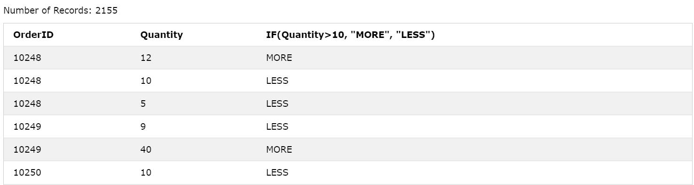

# Advanced functions

## CAST()

- Hàm **CAST()** dùng để chuyển đổi kiểu dữ liệu
- Cú pháp:

```sql
CAST(value AS datatype)
```

| Datatype | Mô tả                                                                                                                                                                                                                                                                                                               |
| -------- | ------------------------------------------------------------------------------------------------------------------------------------------------------------------------------------------------------------------------------------------------------------------------------------------------------------------- |
| DATE     | Chuyển đổi giá trị sang kiểu DATE (định dạng "YYYY-MM-DD")                                                                                                                                                                                                                                                          |
| DATETIME | Chuyển đổi giá trị sang kiểu DATETIME (định dạng "YYYY-MM-DD HH:MM:SS")                                                                                                                                                                                                                                             |
| TIME     | Chuyển đổi giá trị sang kiểu TIME (định dạng "HH:MM:SS")                                                                                                                                                                                                                                                            |
| DECIMAL  | Chuyển đổi sang kiểu thập phân, hàm này nhận vào 2 tham số M và D<br />**M**: Số lượng tất cả các chữ số sau khi chuyển đổi (bao gồm các chữ số đứng trước và sau dấu phẩy). Giá trị này thường để 65 (tối đa) vì ta chưa biết số lượng chữ số cần chuyển đổi là bao nhiêu<br />**D**: Số lượng chữ số sau dấu phẩy |
| CHAR     | Chuyển đổi sang dạng chuỗi                                                                                                                                                                                                                                                                                          |
| NCHAR    | Vẫn là chuyển đổi sang dạng chuỗi nhưng có thể chuyển đổi các kí tự đặc biệt                                                                                                                                                                                                                                        |
| SIGNED   | Chuyển đổi sang dạng số 64 bit có dấu                                                                                                                                                                                                                                                                               |
| UNSIGNED | Chuyển đổi sang dạng số 64 bit không dấu                                                                                                                                                                                                                                                                            |

- Một số ví dụ:

```sql
CAST("-46473.5753" AS SIGNED)
-- Return value: -46473
```

```sql
CAST("-46473.5753" AS DECIMAL(65,2))
-- Return value: -46473.58
```

## COALESCE()

- Cú pháp:

```sql
-- Trả về giá trị đầu tiên khác NULL trong một list các giá trị
COALESCE(val1, val2, ...., val_n)
```

- Ví dụ:

```sql
COALESCE(NULL, NULL, NULL, 'MySQL', NULL, 'Database')
-- Return value: 'MySQL'
```

## IF()

- Cú pháp:

```sql
IF(condition, value_if_true, value_if_false)
```

- Ví dụ:

```sql
IF(500<1000, 5, 10)
-- Return value: 5
```

```sql
SELECT OrderID, Quantity, IF(Quantity>10, "MORE", "LESS")
FROM OrderDetails;
```



## ISNULL()

- Cú pháp:

```sql
-- Trả về 1 nếu giá trị truyền vào là NULL, ngược lại, trả về 0
IFNULL(value)
```

- Ví dụ:

```sql
ISNULL("") -- Return value: 0
ISNULL(NULL) -- Return value: 1
```
