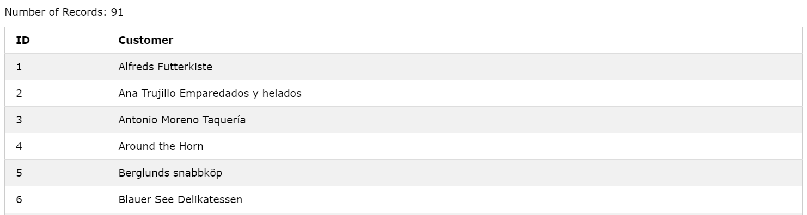
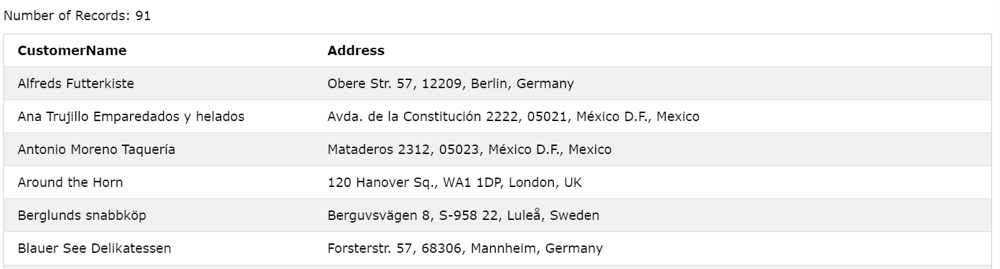

# MySQL ALIASES

- Trong SQL, từ khóa "aliases" được sử dụng để tạo bí danh cho bảng hoặc cột trong câu lệnh SELECT. Aliases cho phép bạn đặt tên tạm thời cho bảng hoặc cột mà bạn muốn sử dụng trong câu lệnh SELECT.
- Có hai loại aliases trong SQL:
  - Column Aliases (Bí danh cột)
  - Table Aliases (Bí danh bảng)

## Column Aliases

- Bạn có thể sử dụng aliases để đặt tên tạm thời cho một cột trong câu lệnh SELECT. Việc này có thể hữu ích khi bạn muốn đổi tên hiển thị của một cột hoặc khi sử dụng các hàm tính toán hoặc biểu thức trong SELECT và muốn đặt tên cho kết quả của chúng
- Cú pháp:

```sql
SELECT column_name AS alias_name
FROM table_name;
```

- Ví dụ:

```sql
SELECT CustomerID AS ID, CustomerName AS Customer
FROM Customers;
```



- Nếu tên bí danh có chứa dấu cách, hãy sử dụng nháy đơn:

```sql
SELECT CustomerName AS Customer, ContactName AS 'Contact Person'
FROM Customers;
```

- Trong ví dụ dưới đây, ta hiển thị tên bí danh Address bằng cách kết hợp 4 cột (Address, PostalCode, City và Country):

```sql
SELECT CustomerName, CONCAT_WS(', ', Address, PostalCode, City, Country) AS Address
FROM Customers;
```



## Table Aliases

- Bạn cũng có thể sử dụng aliases để đặt tên tạm thời cho bảng trong câu lệnh SELECT. Điều này hữu ích khi bạn làm việc với nhiều bảng và muốn viết mã ngắn gọn hơn bằng cách sử dụng tên ngắn gọn để tham chiếu đến bảng.
- Cú pháp:

```sql
SELECT column_name
FROM table_name AS alias_name;
```

- Ví dụ:

```sql
SELECT o.OrderID, o.OrderDate, c.CustomerName
FROM Customers AS c, Orders AS o
WHERE c.CustomerName='Around the Horn' AND c.CustomerID=o.CustomerID;
```
