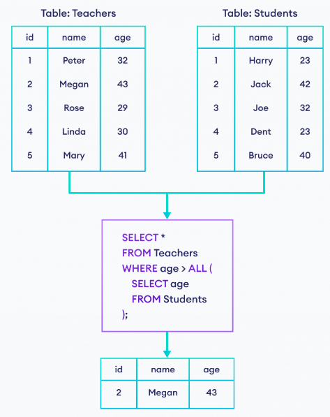

# MySQL ANY, ALL

## ANY

- Trong SQL, từ khóa "ANY" được sử dụng để so sánh một giá trị của một cột với một tập hợp các giá trị và trả về kết quả khi có **ÍT NHẤT** một giá trị trong tập hợp thỏa mãn điều kiện.
- Từ khóa "ANY" thường được sử dụng cùng với các toán tử so sánh như "=", ">", "<", ">=", "<=", "IN" và "LIKE".
- Toán tử "ANY" trả về TRUE nếu bất kỳ giá trị nào của subquery thỏa mãn điều kiện.
- Cú pháp:

```sql
SELECT column_name(s)
FROM table_name
WHERE column_name operator ANY
  (SELECT column_name
  FROM table_name
  WHERE condition);
```

- Giả sử ta có 2 bảng **Products** và **OrderDetails** lần lượt như sau:


- Ta có câu query bên dưới

```sql
SELECT ProductName
FROM Products
WHERE ProductID = ANY
  (SELECT ProductID
  FROM OrderDetails
  WHERE Quantity = 10);
```

:::info

- Với subquery, ta lọc ra những `ProductID` ở bảng **OrderDetails** mà có `Quantity` (số lượng) = 10.
- Tiếp theo, ta sẽ hiển thị ra những `ProductName` ở bảng **Products** mà có `ProductID` thuộc một trong số các `ProductID` trả về ở subquery trên

:::

- Kết quả:


- Cách khác sử dụng [EXISTS](./sql-exists):

```sql
SELECT p.ProductName
FROM Products p
WHERE EXISTS (
	SELECT 1
	FROM OrderDetails od
	WHERE od.ProductID = p.ProductID AND od.Quantity = 10
)
```

- Dưới đây là một số ví dụ khác:


## ALL

- Trong SQL, từ khóa "ALL" được sử dụng để so sánh một giá trị với tất cả các giá trị trong một tập hợp. Nó thường được sử dụng cùng với các toán tử so sánh như "=", ">", "<", ">=", "<=", "IN" và "LIKE".
- Khi sử dụng từ khóa "ALL", bạn so sánh một giá trị với tất cả các giá trị trong một danh sách hoặc kết quả của một câu truy vấn con.
- Toán tử "ALL" trả về TRUE nếu tất cả giá trị của subquery thỏa mãn điều kiện.
- Cú pháp:

```sql
SELECT column_name(s)
FROM table_name
WHERE column_name operator ALL
  (SELECT column_name
  FROM table_name
  WHERE condition);
```

- Một số ví dụ:


