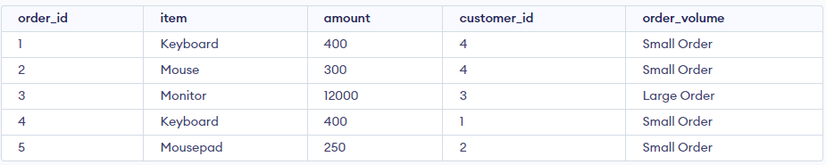
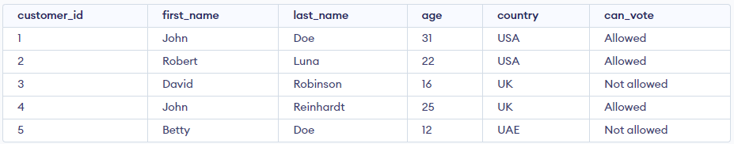
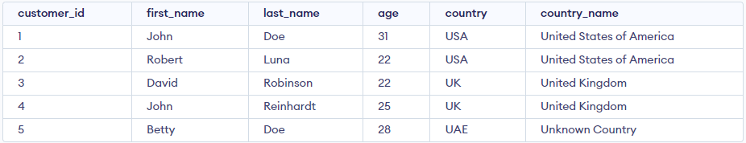

# MySQL CASE

- **CASE** trong SQL là một cấu trúc điều khiển được sử dụng để thực hiện các phép tính hoặc trả về kết quả dựa trên điều kiện xác định. Cấu trúc **CASE** cho phép bạn thực hiện các câu lệnh điều kiện tùy thuộc vào giá trị của một cột hoặc biểu thức trong câu lệnh **SELECT**.
- Câu lệnh **CASE** xem xét các điều kiện và trả về một giá trị khi điều kiện đầu tiên được đáp ứng (như câu lệnh if-then-else). Vì vậy, khi điều kiện đúng, nó sẽ ngừng đọc và trả về kết quả. Nếu không có điều kiện nào đúng, nó sẽ trả về giá trị trong mệnh đề **ELSE**.
- Cú pháp:

```sql
CASE
    WHEN condition1 THEN result1
    WHEN condition2 THEN result2
    WHEN conditionN THEN resultN
    ELSE result
END;
```

## Ví dụ 1

```sql
SELECT *,
CASE
  WHEN amount >= 10000 THEN 'Large Order'
  WHEN amount < 10000 THEN 'Small Order'
END AS 'order_volume'
FROM Orders;
```



## Ví dụ 2

```sql
SELECT *,
CASE
  WHEN age >= 18 THEN 'Allowed'
  ELSE 'Not allowed'
END AS can_vote
FROM Customers;
```



## Ví dụ 3

```sql
SELECT *,
CASE
    WHEN country = 'USA' THEN 'United States of America'
    WHEN country = 'UK' THEN 'United Kingdom'
    ELSE 'Unknown Country'
END AS country_name
FROM Customers;
```



## Ví dụ 4

- Câu query sau sẽ sắp xếp customers theo `City`, nếu `City` có giá trị `NULL`, nó sẽ sắp xếp theo `Country`

```sql
SELECT CustomerName, City, Country
FROM Customers
ORDER BY
(CASE
    WHEN City IS NULL THEN Country
    ELSE City
END);
```
