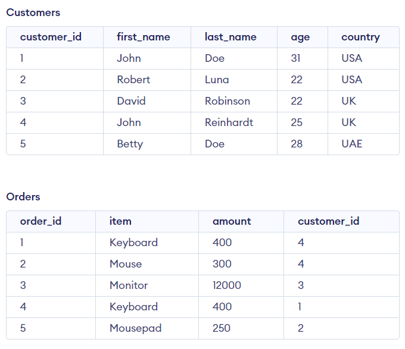
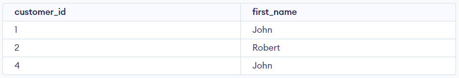
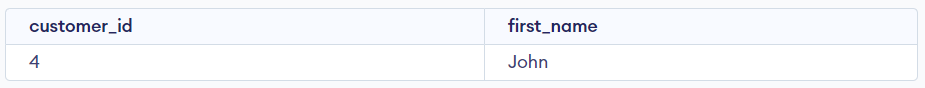
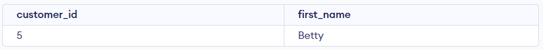

# MySQL EXISTS

## EXISTS là gì?

- Trong SQL, **EXISTS** là một toán tử logic được sử dụng để kiểm tra sự tồn tại của một bản ghi trong một câu truy vấn. Nó trả về giá trị TRUE nếu câu truy vấn con trong **EXISTS** trả về ít nhất một bản ghi, và FALSE nếu không có bản ghi nào tương ứng.
- Cú pháp:

```sql
SELECT column1, column2, ...
FROM table_name
WHERE EXISTS (subquery);
```

- Trong đó, subquery là một câu truy vấn con được sử dụng để kiểm tra sự tồn tại. Nếu subquery trả về ít nhất một bản ghi, câu truy vấn chính sẽ trả về các cột được chỉ định trong phần **SELECT**.

## Ví dụ 1

- Giả sử ta có 2 bảng sau:



- Giờ ta muốn lọc ra những customer đặt đơn hàng và có số lượng < 12000:

```sql
SELECT customer_id, first_name
FROM Customers
WHERE EXISTS (
  SELECT 1
  FROM Orders
  WHERE Orders.customer_id = Customers.customer_id AND amount < 12000
);
```



- Nâng cao hơn, bây giờ ta muốn lọc ra những customer có số lượng đặt hàng >=2:

```sql
SELECT customer_id, first_name
FROM Customers
WHERE EXISTS (
  SELECT 1
  FROM Orders
  WHERE Customers.customer_id = Orders.customer_id
  GROUP BY Orders.customer_id
  HAVING COUNT(*) >= 2
);

--Cách khác
SELECT Customers.customer_id, Customers.first_name
FROM Customers
INNER JOIN Orders ON Orders.customer_id = Customers.customer_id
GROUP BY Customers.customer_id
HAVING COUNT(*) >= 2
```



- Bây giờ, ta muốn lọc ra những customer không đặt đơn hàng nào, ta sẽ thêm toán tử **NOT** trước **EXISTS**:

```sql
SELECT customer_id, first_name
FROM Customers
WHERE NOT EXISTS (
  SELECT 1
  FROM Orders
  WHERE Customers.customer_id = Orders.customer_id
);

--Cách khác
SELECT Customers.customer_id, Customers.first_name
FROM Customers
LEFT JOIN Orders ON Orders.customer_id = Customers.customer_id
GROUP BY Orders.customer_id
HAVING COUNT(Orders.order_id) = 0
```


