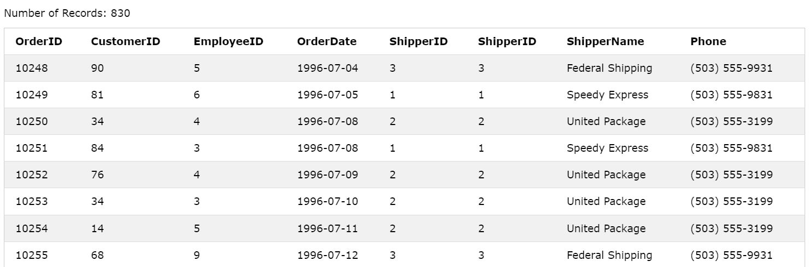
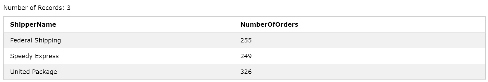

# MySQL GROUP BY

:::info

- Trong SQL, mệnh đề **GROUP BY** được sử dụng để nhóm các hàng trong một bảng theo một hoặc nhiều cột và áp dụng các hàm tổng hợp (aggregate functions) như `COUNT()`, `MAX()`, `MIN()`, `SUM()`, `AVG()` vào các nhóm này. **GROUP BY** giúp tạo ra các tập kết quả (result set) được tổ chức thành các nhóm dựa trên các giá trị trong cột được chỉ định.
- Khi sử dụng **GROUP BY**, các hàng trong bảng sẽ được chia thành các nhóm dựa trên các giá trị duy nhất trong cột được chỉ định. Sau đó, các hàm tổng hợp có thể được áp dụng vào mỗi nhóm để tính toán giá trị tổng hợp cho từng nhóm. Kết quả trả về sẽ là một tập hợp các nhóm kèm theo các giá trị tổng hợp tương ứng.
- Cú pháp:

```sql
SELECT column_name(s)
FROM table_name
WHERE condition
GROUP BY column_name(s)
ORDER BY column_name(s);
```

:::

## Ví dụ 1

- Ta có bảng **student** sau:

| student_id | name  | age | address   |
| ---------- | ----- | --- | --------- |
| 1          | Quynh | 25  | Hanoi     |
| 2          | Chi   | 24  | QuangNinh |
| 3          | Toan  | 25  | Hanoi     |
| 4          | Hung  | 25  | PhuTho    |
| 5          | Quang | 23  | BacGiang  |
| 6          | Huy   | 23  | Hanoi     |
| 7          | Lam   | 25  | HungYen   |
| 8          | Phong | 23  | LaoCai    |
| 9          | Huyen | 24  | ThanhHoa  |
| 10         | Quan  | 23  | HaNam     |

- Giờ ta sẽ thực hiện câu truy vấn sau:

```sql
SELECT age, COUNT(student_id)
FROM student
GROUP BY age;
```

- Kết quả:

| age | COUNT(student_id) |
| --- | ----------------- |
| 25  | 4                 |
| 24  | 2                 |
| 23  | 4                 |

:::note

- Trong câu truy vấn trên, ta sử dụng **GROUP BY** để nhóm tất cả các hàng theo tuổi (age), do đó kết quả trả về bao gồm 3 hàng tương ứng với 3 nhóm tuổi khác nhau có trong bảng. Sau đó, với mỗi nhóm tuổi, ta thực hiện đếm số lượng sinh viên

:::

## Ví dụ 2

- Giả sử ta có 2 bảng **Shippers** và **Orders**. Trong đó bảng **Orders** chứa cột `ShipperID` là khóa ngoại liên kết với bảng **Shippers**. Giờ ta sẽ thực hiện **INNER JOIN** trước để xem qua:

```sql
SELECT *
INNER JOIN Shippers ON Orders.ShipperID = Shippers.ShipperID;
```



- Bây giờ, ta sẽ sử dụng **GROUP BY** để nhóm các hàng theo `ShipperName`, sau đó sử dụng hàm `COUNT()` để đếm số lượng order của từng shipper:

```sql
SELECT Shippers.ShipperName, COUNT(Orders.OrderID) AS NumberOfOrders FROM Orders
INNER JOIN Shippers ON Orders.ShipperID = Shippers.ShipperID
GROUP BY ShipperName;
```


