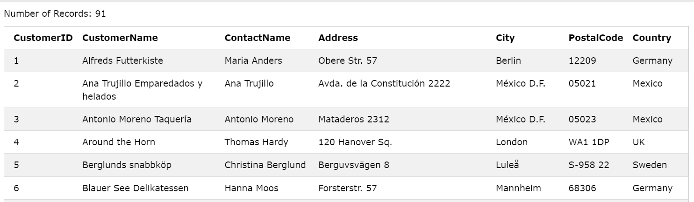
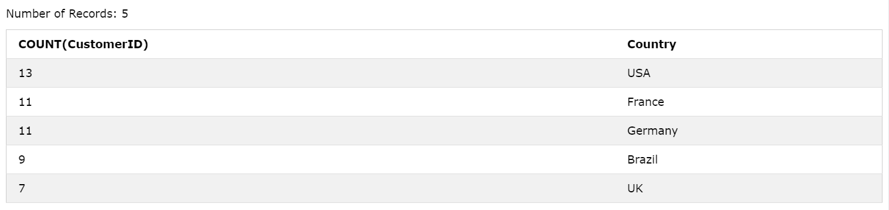
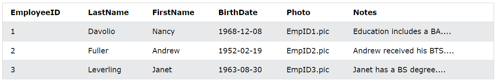
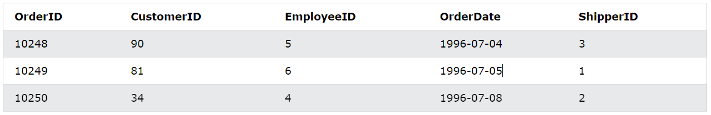
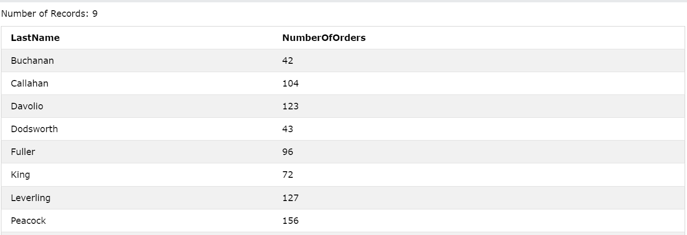

# MySQL HAVING

## HAVING là gì?

- Lệnh **HAVING** trong MySQL ho phép người dùng lọc các kết quả truy vấn dựa trên những hàm tổng hợp (`COUNT()`, `MAX()`, `MIN()`, `SUM()`, `AVG()`) và theo nhóm mà không thể đạt được bằng mệnh đề **WHERE** (được dùng để lọc từng hàng riêng lẻ).
- Đặc điểm của từ khóa **HAVING**:

  - Mệnh đề **HAVING** chỉ được dùng với mệnh đề **SELECT**.
  - Mệnh đề **HAVING** luôn được triển khai cùng với lệnh **GROUP BY**.

- Cú pháp:

```sql
SELECT column_name(s)
FROM table_name
WHERE condition
GROUP BY column_name(s)
HAVING condition
ORDER BY column_name(s);
```

## Ví dụ 1

- Giả sử ta có bảng **Customers** có dạng như sau:



- Câu query sau sẽ thống kê số lượng Customer theo Country và chỉ lấy ra những Country có số lượng customer lớn hơn 5, và sắp xếp theo số lượng customer giảm dần:

```sql
SELECT COUNT(CustomerID), Country
FROM Customers
GROUP BY Country
HAVING COUNT(CustomerID) > 5
ORDER BY COUNT(CustomerID) DESC;
```



## Ví dụ 2

- Giả sử ta có 2 bảng **Orders** và **Employees** như hình dưới, trong đó bảng **Orders** có cột `EmployeeID` là khóa ngoại liên kết với bảng **Employees**.





- Câu truy vấn sau sẽ liệt kê những nhân viên có từ 10 orders trở lên:

```sql
SELECT Employees.LastName, COUNT(Orders.OrderID) AS NumberOfOrders
FROM (Orders
INNER JOIN Employees ON Orders.EmployeeID = Employees.EmployeeID)
GROUP BY LastName
HAVING COUNT(Orders.OrderID) > 10;
```


