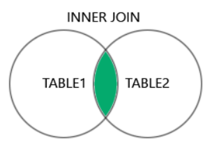
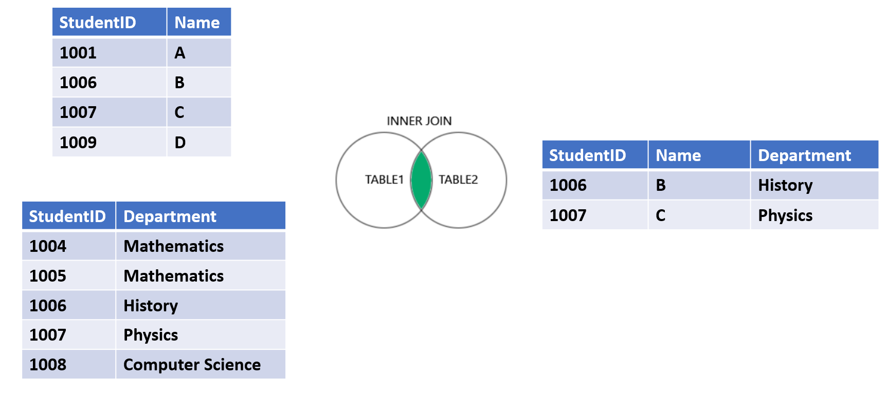

# INNER JOIN

:::info



- **INNER JOIN** trong MySQL trả về tập hợp kết quả của việc kết hợp các hàng từ hai bảng dựa trên một điều kiện được chỉ định và chỉ bao gồm các hàng từ cả hai bảng mà khớp với điều kiện kết nối.
- Khi sử dụng **INNER JOIN**, chỉ có các hàng từ cả hai bảng mà khớp với điều kiện kết nối sẽ được bao gồm trong kết quả. Các hàng không khớp sẽ không được hiển thị trong kết quả.
- Các cột mà **INNER JOIN** trả về bao gồm TẤT CẢ các cột của cả 2 bảng (hoặc nhiều bảng) tham gia gộp lại.
- Cú pháp:

```sql
SELECT column_name(s)
FROM table1
INNER JOIN table2
ON table1.column_name = table2.column_name;
```

:::

## Ví dụ



## Ví dụ khi JOIN 3 bảng

- Giả sử ta có 3 bảng sau:

**Customers**

| customer_id | customer_id | last_name | age | country |
| ----------- | ----------- | --------- | --- | ------- |
| 1           | John        | Doe       | 31  | USA     |
| 2           | Robert      | Luna      | 22  | USA     |
| 3           | David       | Robinson  | 22  | UK      |
| 4           | John        | Reinhardt | 25  | UK      |
| 5           | Betty       | Doe       | 28  | UAE     |

**Orders**

| order_id | item     | amount | customer_id |
| -------- | -------- | ------ | ----------- |
| 1        | Keyboad  | 400    | 4           |
| 2        | Mouse    | 300    | 4           |
| 3        | Monitor  | 12000  | 3           |
| 4        | Keyboad  | 400    | 1           |
| 5        | Mousepad | 350    | 2           |

**Shippings**

| shipping_id | status    | customer |
| ----------- | --------- | -------- |
| 1           | Pending   | 2        |
| 2           | Pending   | 4        |
| 3           | Delivered | 3        |
| 4           | Pending   | 5        |
| 5           | Delivered | 1        |

- Với 2 câu lệnh SELECT sau, sẽ cho kết quả như bảng dưới:

```sql
SELECT Customers.customer_id, first_name, last_name, country, Orders.item, Orders.amount, Shippings.status
FROM Orders
INNER JOIN Customers ON Customers.customer_id = Orders.customer_id
INNER JOIN Shippings ON Shippings.customer = Customers.customer_id
ORDER BY Customers.customer_id;
```

```sql
SELECT Customers.customer_id, first_name, last_name, country, Orders.item, Orders.amount, Shippings.status
FROM Customers
INNER JOIN Orders ON Orders.customer_id = Customers.customer_id
INNER JOIN Shippings ON Shippings.customer = Customers.customer_id
ORDER BY Customers.customer_id;
```

| customer_id | first_name | last_name | country | item     | amount | status    |
| ----------- | ---------- | --------- | ------- | -------- | ------ | --------- |
| 1           | John       | Doe       | USA     | Keyboard | 400    | Delivered |
| 2           | Robert     | Luna      | USA     | Mousepad | 250    | Pending   |
| 3           | David      | Robinson  | UK      | Monitor  | 12000  | Delivered |
| 4           | John       | Reinhardt | UK      | Keyboard | 400    | Pending   |
| 4           | John       | Reinhardt | UK      | Mouse    | 300    | Pending   |
