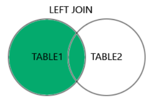
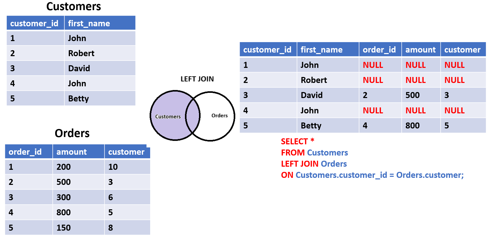
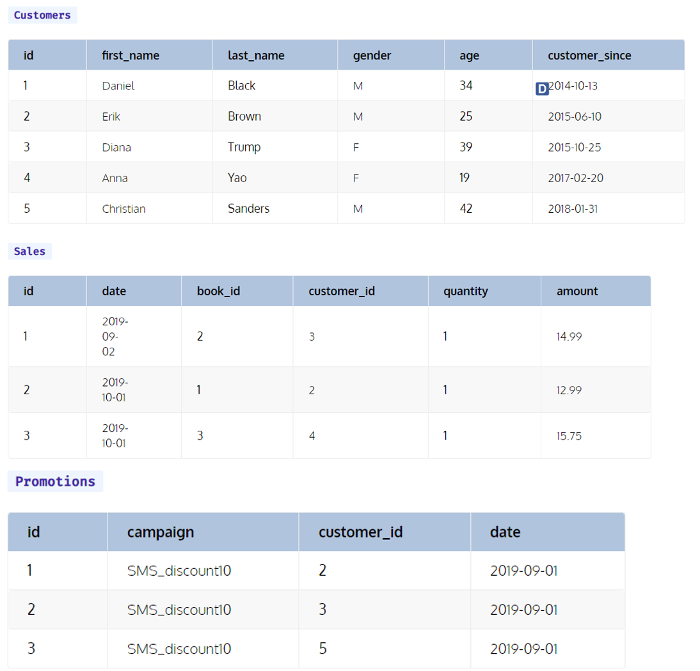
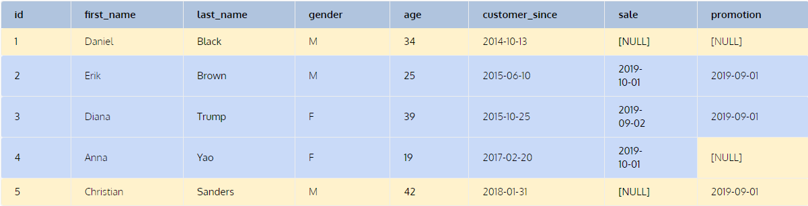

# LEFT JOIN

:::info



- **LEFT JOIN** trong MySQL trả về tập hợp kết quả của việc kết hợp các hàng từ hai bảng dựa trên một điều kiện được chỉ định và bao gồm tất cả các hàng từ bảng bên trái (bảng đầu tiên trong câu lệnh **LEFT JOIN**) và các hàng từ bảng bên phải (bảng thứ hai trong câu lệnh **LEFT JOIN**) mà khớp với điều kiện kết nối.
- Khi sử dụng **LEFT JOIN**, tất cả các hàng từ bảng bên trái sẽ được bao gồm trong kết quả kể cả khi không có khớp từ bảng bên phải. Nếu không có khớp, các cột từ bảng bên phải sẽ có giá trị **NULL** trong kết quả.
- Cú pháp:

```sql
SELECT column_name(s)
FROM table1
LEFT JOIN table2
ON table1.column_name = table2.column_name;
```

:::

## Ví dụ



## Ví dụ khi JOIN 3 bảng

- Ta có 3 bảng sau:



- Giờ hãy xem câu lệnh sau trả về gì:

```sql
SELECT c.id, c.first_name, c.last_name, c.gender, c.age, c.customer_since,
   s.date AS sale, p.date AS promotion
FROM customers c
LEFT JOIN sales s
ON c.id = s.customer_id
LEFT JOIN promotions p
ON c.id = p.customer_id;
```



- Như ta có thể thấy, bằng cách sử dụng **LEFT JOIN**, câu lệnh trên vẫn trả về tất cả các record của bảng Customers bất kể lịch sử mua hàng (Purchases) hay tham gia chiến dịch quảng cáo (Promotions).
  - Customer có ID = 1 vẫn có trong bảng kết quả mặc dù họ không mua hàng hay tham gia vào chiến dịch quảng cáo
  - Customer có ID = 4, người mà mua hàng nhưng lại không tham gia quảng cáo
  - Customer có ID = 5, người tham gia quảng cáo nhưng lại không mua hàng
  - Và cuối cùng là Customer có ID = 2, 3, họ tham gia cả mua hàng lẫn quảng cáo
