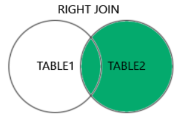

# RIGHT JOIN

:::info



- **RIGHT JOIN** là một loại JOIN trong SQL, nó kết hợp các hàng từ bảng bên phải (right table) với các hàng từ bảng bên trái (left table) dựa trên một điều kiện kết hợp. Kết quả của **RIGHT JOIN** là tất cả các hàng từ bảng bên phải, kể cả những hàng không có sự kết hợp với bảng bên trái. Các hàng từ bảng bên trái chỉ được bao gồm trong kết quả nếu chúng có sự kết hợp với bảng bên phải.

* Kết quả của **RIGHT JOIN** sẽ chứa tất cả các cột từ cả bảng bên trái và bảng bên phải. Nếu không có sự kết hợp cho một hàng từ bảng bên phải, các cột từ bảng bên trái sẽ có giá trị **NULL** trong kết quả.
* Cú pháp:

```sql
SELECT column_name(s)
FROM table1
RIGHT JOIN table2
ON conditions;
```

:::
