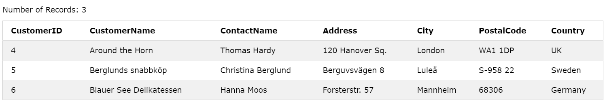

# MySQL LIMIT

:::info

- Từ khóa **LIMIT** dùng để chỉ định số lượng record trả về khi thực hiện **SELECT**
- Ta dùng từ khóa **OFFSET** để bỏ qua số lượng các record đầu

:::

## Ví dụ

```sql
-- Lấy 3 record từ bảng Customers bắt đầu từ record thứ 4 (bỏ qua 3 record đầu tiên)
SELECT * FROM Customers LIMIT 3 OFFSET 3;
```


