# MySQL MIN, MAX, COUNT, SUM, AVG

## MAX()

- Hàm **MAX()** trả về giá trị lớn nhất trong cột được chỉ định.
- Cú pháp:

```sql
SELECT MAX(column_name)
FROM table_name
WHERE condition;
```

- Ví dụ:

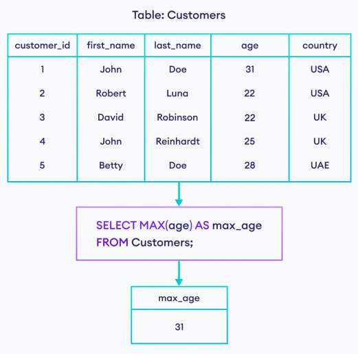

## MIN()

- Hàm **MIN()** trả về giá trị nhỏ nhất trong cột được chỉ định.
- Cú pháp:

```sql
SELECT MIN(column_name)
FROM table_name
WHERE condition;
```

- Ví dụ:

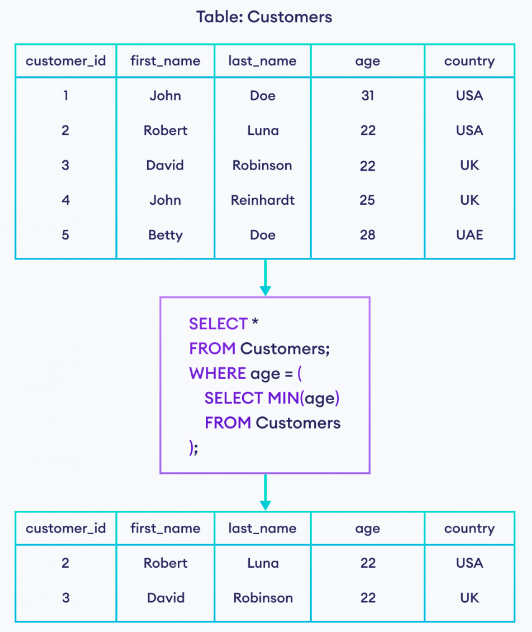

## COUNT()

- Hàm **COUNT()** trả về số hàng khớp với một tiêu chí đã chỉ định.
- Cú pháp:

```sql
SELECT COUNT(column_name)
FROM table_name
WHERE condition;
```

- Ví dụ:

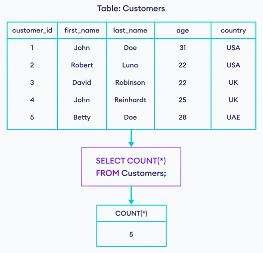

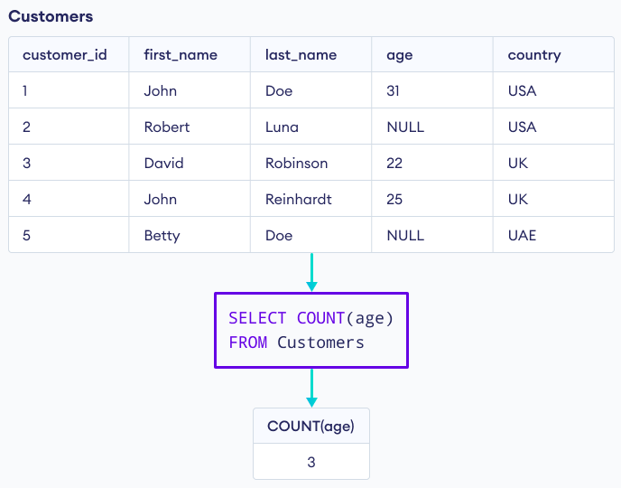

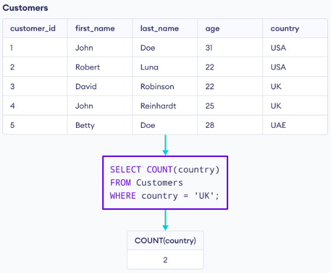

- Chúng ta có thể sử dụng **COUNT()** cùng với **DISTINCT** để đếm những hàng có giá trị khác nhau

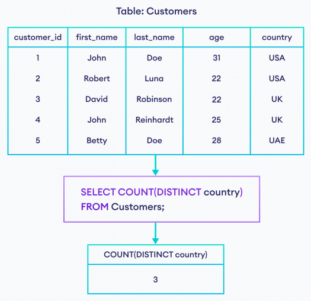

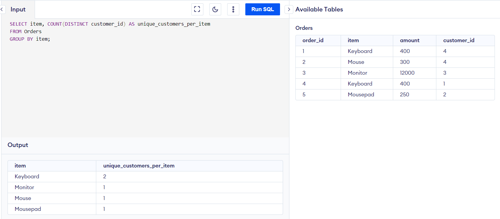

## SUM()

- Hàm **SUM()** trả về tổng tất cả các giá trị trong một cột được chỉ định (cột này phải có kiểu dữ liệu số).
- Cú pháp:

```sql
SELECT SUM(column_name)
FROM table_name
WHERE condition;
```

- Ví dụ:

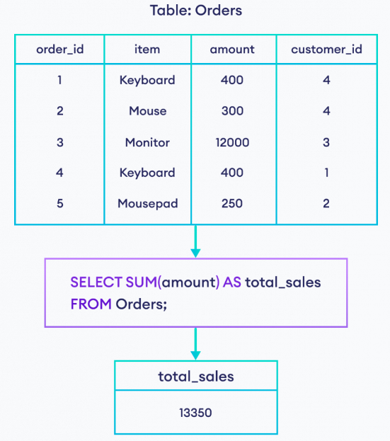

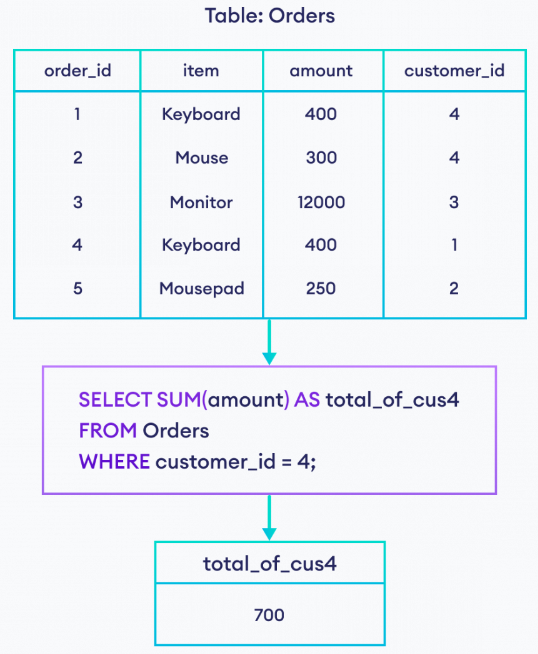

## AVG()

- Hàm **AVG()** trả về giá trị trung bình của một cột được chỉ định (cột này phải có kiểu dữ liệu số).
- Cú pháp:

```sql
SELECT AVG(column_name)
FROM table_name
WHERE condition;
```

- Ví dụ:

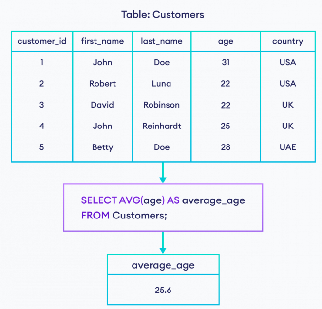

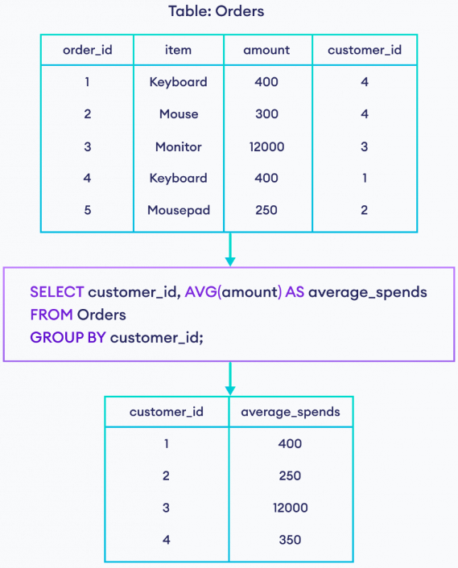
