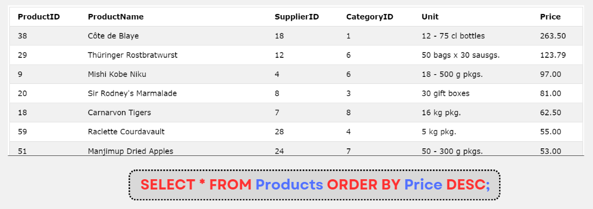

# MySQL ORDER BY

:::info

- Từ khóa **ORDER BY** được dùng để sort các hàng theo thứ tự tăng dần, hoặc giảm dần của cột được chỉ định
- Có hai từ khóa là: **ASC** (tăng dần) và **DESC** (giảm dần)
- Giá trị mặc định là **ASC** (tăng dần)
- Cú pháp:

```sql
SELECT column1, column2, ...
FROM table_name
ORDER BY column1, column2, ... ASC|DESC;
```

:::

## Ví dụ



- Câu lệnh sau sắp xếp cột Country tăng dần, nếu có 2 hàng có cùng Country, sẽ sắp xếp theo CustomerName tăng dần:

```sql
SELECT * FROM Customers
ORDER BY Country, CustomerName;
```

- Câu lệnh sau sắp xếp cột Country tăng dần, nếu có 2 hàng có cùng Country, sẽ sắp xếp theo CustomerName giảm dần:

```sql
SELECT * FROM Customers
ORDER BY Country ASC, CustomerName DESC;
```
