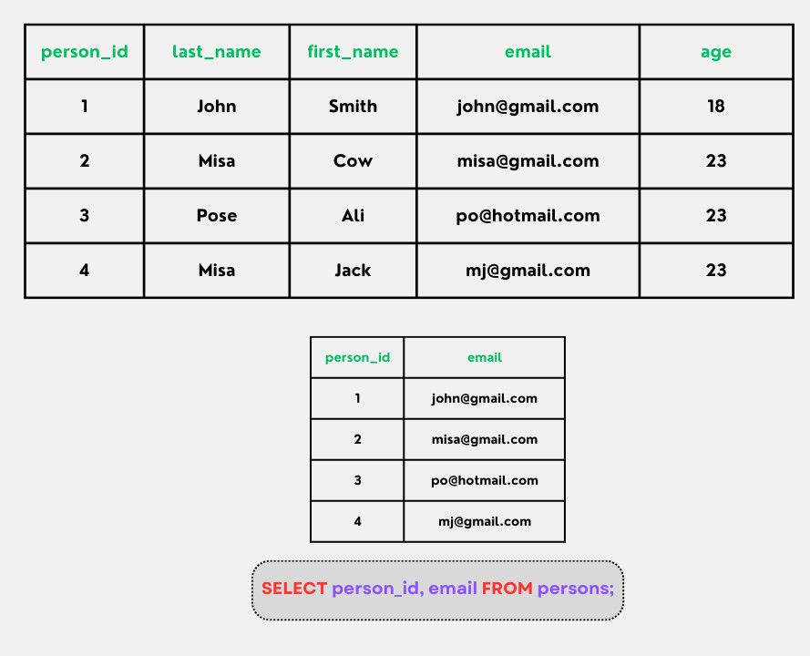
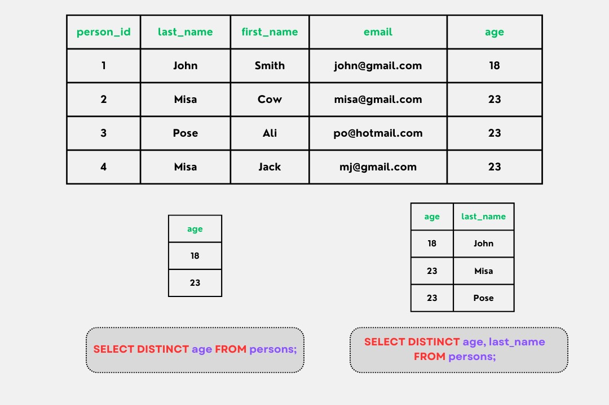
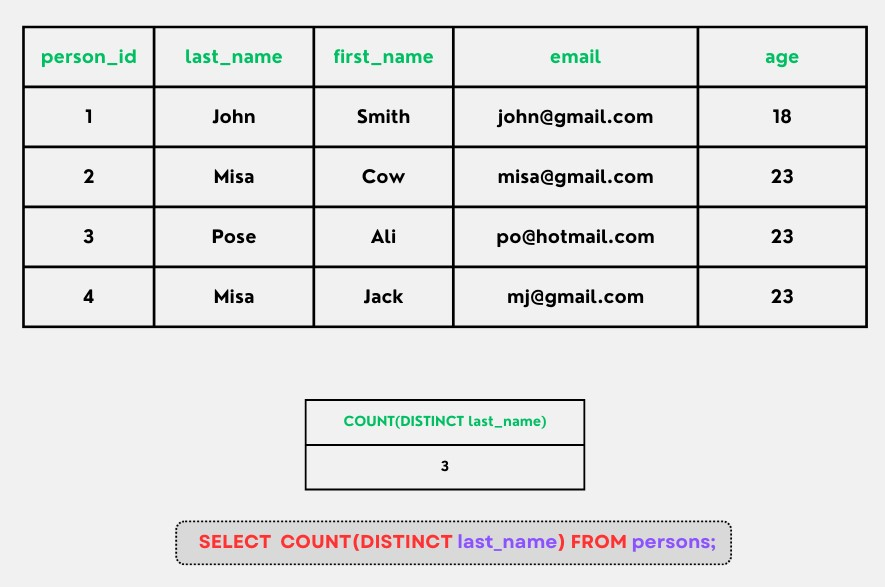

# MySQL SELECT

## SELECT

- Câu lệnh SELECT để select dữ liệu từ database
- Cú pháp:

```sql
SELECT column1, column2, ...
FROM table_name;
```

- Trong đó column1, column2,... là tên các cột mà ta muốn select, nếu ta muốn select tất cả các cột, sử dụng cú pháp sau:

```sql
SELECT * FROM table_name;
```



## SELECT DISTINCT

- Bên trong một bảng, một cột thường chứa nhiều giá trị trùng lặp; và đôi khi bạn chỉ muốn liệt kê các giá trị (riêng biệt) khác nhau. Do đó, ta sẽ sử dụng câu lệnh **SELECT DISTINCT**
- Cú pháp:

```sql
SELECT DISTINCT column1, column2, ...
FROM table_name;
```

- Ví dụ:



- Để hiển thị số lượng giá trị khác nhau, ta dùng **COUNT()**

```sql
SELECT COUNT(DISTINCT column1, column2,...) FROM table_name;
```


