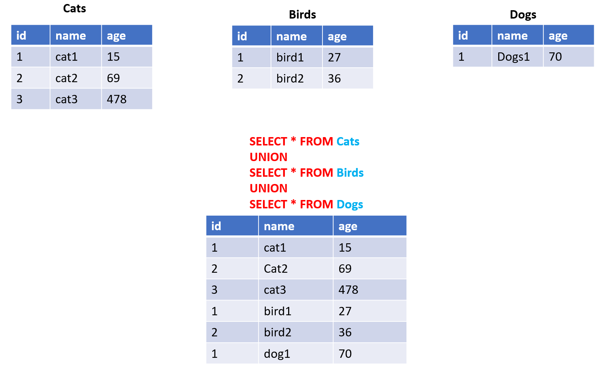

# MySQL UNION

## UNION

- Câu lệnh **UNION** trong SQL được sử dụng để kết hợp hai hoặc nhiều kết quả của các câu lệnh **SELECT** thành một tập hợp duy nhất. Câu lệnh **UNION** chỉ trả về các giá trị duy nhất trong kết quả cuối cùng.
- Lưu ý rằng các câu lệnh **SELECT** phải có cùng số lượng cột và kiểu dữ liệu tương ứng. Các cột được chọn trong câu lệnh **SELECT** phải có kiểu dữ liệu tương thích hoặc ép kiểu được thực hiện.
- Cú pháp:

```sql
SELECT column1, column2, ... FROM table1
UNION
SELECT column1, column2, ... FROM table2
```

- Ví dụ:

  

## UNION ALL

- Cú pháp:

```sql
SELECT column1, column2, ... FROM table1
UNION ALL
SELECT column1, column2, ... FROM table2

```

- **UNION ALL** cũng tương tự như **UNION**, nhưng nó trả về các record (row) bị trùng lặp.
- Một record được gọi là giống với record kia nếu các giá trị của tất cả các column tương ứng giống nhau
